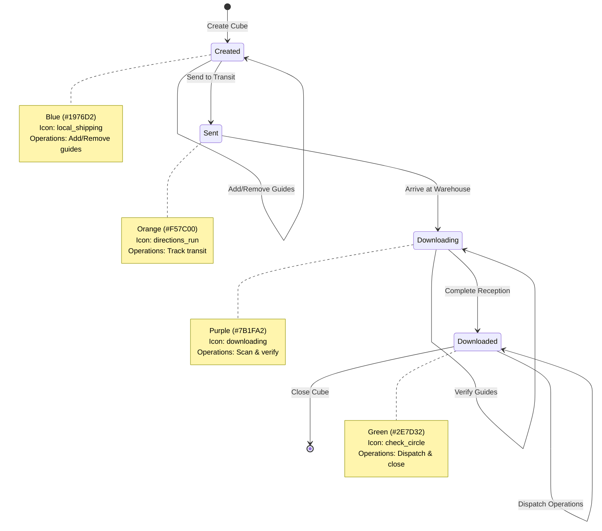

## Overview

GBI Logistics implements a linear 4-stage state workflow for transport cubes. This workflow ensures proper sequencing of operations and maintains data integrity throughout the logistics pipeline.

## The 4-Stage Workflow

Transport cubes progress through four distinct stages in a linear, unidirectional flow:


<Note>
  State transitions are **unidirectional** and **sequential**. Cubes cannot skip stages or move backwards in the workflow.
</Note>

## State Details

### Stage 1: Created

<Card title="Created" icon="shipping-fast" color="#1976D2">
  **Initial Stage - Customs Dispatch**
  
  The transport cube has been initialized and guides are being added.
</Card>

**Characteristics:**
- Cube is created in the customs dispatch area
- Guides can be added or removed
- Cube is not yet in transit
- Operator assigns guides based on destination/route

**Available Operations:**
- Add guides to cube
- Remove guides from cube
- Move guides between cubes
- Close cube (if contains guides)
- Transition to "Sent" state

**Code Reference:**
```dart lib/features/logistics/models/transport_cube_state.dart
class TransportCubeState {
  /// Estado cuando el cubo es creado en despacho de aduana
  static const String created = 'Created';
  
  static String getLabel(String state) {
    switch (state) {
      case created:
        return 'Creado';
      // ...
    }
  }
  
  static int getColor(String state) {
    switch (state) {
      case created:
        return 0xFF1976D2; // Blue
      // ...
    }
  }
  
  static IconData getIcon(String state) {
    switch (state) {
      case created:
        return Icons.local_shipping;
      // ...
    }
  }
}
```

### Stage 2: Sent

<Card title="Sent" icon="truck" color="#F57C00">
  **In Transit - Moving to Warehouse**
  
  The cube is in transit from customs to the warehouse facility.
</Card>

**Characteristics:**
- Cube is physically in transit
- Guide modifications are restricted
- Tracking updates occur during transport
- Expected arrival time is monitored

**Available Operations:**
- View cube details and contents
- Track transit progress
- Transition to "Downloading" state (when arriving at warehouse)

**Business Rules:**
- Cannot add/remove guides while in transit
- Cannot move cube back to "Created" state
- Must reach warehouse before progressing to next stage

**Code Example:**
```dart Transitioning to Sent State
final request = ChangeTranportCubesStateRequest(
  transportCubeIds: [cubeId],
  newState: TransportCubeState.sent,
);

final response = await transportCubeService.changeTransportCubesState(request);

if (response.isSuccessful) {
  print('Cube is now in transit');
} else {
  print('Failed to send cube: ${response.messageDetail}');
}
```

### Stage 3: Downloading

<Card title="Downloading" icon="download" color="#7B1FA2">
  **Reception in Progress - Warehouse Processing**
  
  The cube has arrived and is being received/processed at the warehouse.
</Card>

**Characteristics:**
- Cube has physically arrived at warehouse
- Guides are being verified and checked in
- Reception process is in progress
- Discrepancies are identified and resolved

**Available Operations:**
- Scan and verify guides
- Mark guides as entered/extracted
- Report missing or damaged items
- Transition to "Downloaded" state (when reception complete)

**Business Rules:**
- All guides must be scanned and verified
- Discrepancies must be documented
- Cannot proceed until reception is complete

**Validation During Reception:**
```dart Verifying Guide During Reception
// Scan guide during reception
final packageCode = await scanGuideBarcode();

// Validate guide belongs to this cube
final isInCube = cubeDetails.guides.any(
  (guide) => guide.packageCode == packageCode
);

if (!isInCube) {
  showError('Guide does not belong to this cube');
  return;
}

// Mark guide as entered
await markGuideAsEntered(cubeId, packageCode);

// Check if all guides received
if (allGuidesReceived()) {
  // Allow transition to Downloaded
  showOption('Complete reception?');
}
```

### Stage 4: Downloaded

<Card title="Downloaded" icon="check-circle" color="#2E7D32">
  **Reception Complete - Ready for Dispatch**
  
  The cube has been fully received and is ready for final dispatch to clients.
</Card>

**Characteristics:**
- All guides have been verified and received
- Cube is ready for final dispatch operations
- Guides can be dispatched to end customers
- Cube can be closed

**Available Operations:**
- Dispatch guides to clients
- Dispatch to subcouriers
- Close cube (if allowed)
- Generate dispatch reports

**Business Rules:**
- Cube must have `allowClose: true` to be closed
- All guides should be accounted for
- Final disposition recorded for each guide

**Final Dispatch Flow:**
```dart Dispatching Downloaded Cube
// Check if cube can be closed
if (!cube.allowClose) {
  showWarning('Cube cannot be closed yet');
  return;
}

// Dispatch to client
final dispatchResponse = await transportCubeService.dispatchCubeToClient([cubeId]);

if (dispatchResponse.isSuccessful) {
  // Close the cube
  final closeResponse = await transportCubeService.closeTransportCubes([cubeId]);
  
  if (closeResponse.isSuccessful) {
    showSuccess('Cube dispatched and closed successfully');
  }
}
```

## State Transition Rules

### Valid Transitions

<table>
  <thead>
    <tr>
      <th>Current State</th>
      <th>Valid Next States</th>
      <th>Trigger</th>
    </tr>
  </thead>
  <tbody>
    <tr>
      <td>Created</td>
      <td>Sent</td>
      <td>Operator sends cube to transit</td>
    </tr>
    <tr>
      <td>Sent</td>
      <td>Downloading</td>
      <td>Cube arrives at warehouse</td>
    </tr>
    <tr>
      <td>Downloading</td>
      <td>Downloaded</td>
      <td>Reception process completed</td>
    </tr>
    <tr>
      <td>Downloaded</td>
      <td>None (Terminal state)</td>
      <td>Cube is closed or dispatched</td>
    </tr>
  </tbody>
</table>

### Invalid Transitions

<Warning>
  The following transitions are **NOT allowed**:
  
  - Skipping stages (e.g., Created → Downloading)
  - Backwards transitions (e.g., Downloaded → Sent)
  - Lateral transitions (e.g., Created → Downloaded)
</Warning>

## State Management Implementation

The `TransportCubeState` class provides complete state management:

```dart lib/features/logistics/models/transport_cube_state.dart
class TransportCubeState {
  /// Estados posibles de un cubo de transporte
  static const String created = 'Created';
  static const String sent = 'Sent';
  static const String downloading = 'Downloading';
  static const String downloaded = 'Downloaded';

  /// Lista de todos los estados posibles
  static const List<String> values = [
    created,
    sent,
    downloading,
    downloaded,
  ];

  /// Obtiene la etiqueta amigable para mostrar al usuario
  static String getLabel(String state) {
    switch (state) {
      case created: return 'Creado';
      case sent: return 'Enviado';
      case downloading: return 'Descargando';
      case downloaded: return 'Descargado';
      default: return 'Desconocido';
    }
  }

  /// Color sugerido para UI por estado
  static int getColor(String state) {
    switch (state) {
      case created: return 0xFF1976D2;    // Blue
      case sent: return 0xFFF57C00;       // Orange
      case downloading: return 0xFF7B1FA2; // Purple
      case downloaded: return 0xFF2E7D32;  // Green
      default: return 0xFF9E9E9E;         // Gray
    }
  }

  /// Ícono sugerido para UI por estado
  static IconData getIcon(String state) {
    switch (state) {
      case created: return Icons.local_shipping;
      case sent: return Icons.directions_run;
      case downloading: return Icons.downloading;
      case downloaded: return Icons.check_circle;
      default: return Icons.info_outline;
    }
  }
}
```

## State Change Service

State transitions are handled through the `TransportCubeService`:

```dart lib/features/logistics/services/transport_cube_service.dart
/// Cambia el estado de uno o más cubos de transporte
Future<ApiResponse<void>> changeTransportCubesState(
  ChangeTranportCubesStateRequest request,
) async {
  developer.log(
    'Sending state change request:\n'
    '- Cube IDs: ${request.transportCubeIds.join(", ")}\n'
    '- New state: ${request.newState}',
    name: 'TransportCubeService',
  );

  final response = await _http.put<void>(
    '${ApiEndpoints.changeTransportCubeState}?version=${ApiConfig.version}',
    request.toJson(),
    (_) {},
    suppressAuthHandling: true,
  );

  if (!response.isSuccessful) {
    developer.log(
      'Failed to change cubes state - Error: ${response.messageDetail}',
      name: 'TransportCubeService',
    );
  } else {
    developer.log(
      'Successfully changed state for ${request.transportCubeIds.length} cube(s)',
      name: 'TransportCubeService',
    );
  }

  return response;
}
```

## Complete State Workflow Diagram



## Practical Examples

### Example 1: Creating and Progressing a Cube

```dart Complete Workflow Example
// Step 1: Create cube in Created state
final createRequest = NewTransportCubeRequest(
  guideCodes: ['GBI001', 'GBI002', 'GBI003'],
  type: CubeType.transitToWarehouse,
);

final createResponse = await transportCubeService.createTransportCube(createRequest);
final cubeId = createResponse.content?.content?.id;

print('Cube created with ID: $cubeId in state: Created');

// Step 2: Send to transit (Created → Sent)
await Future.delayed(Duration(seconds: 5)); // Simulate preparation

final sentRequest = ChangeTranportCubesStateRequest(
  transportCubeIds: [cubeId],
  newState: TransportCubeState.sent,
);

await transportCubeService.changeTransportCubesState(sentRequest);
print('Cube is now in transit: Sent');

// Step 3: Arrive at warehouse (Sent → Downloading)
await Future.delayed(Duration(hours: 2)); // Simulate transit time

final downloadingRequest = ChangeTranportCubesStateRequest(
  transportCubeIds: [cubeId],
  newState: TransportCubeState.downloading,
);

await transportCubeService.changeTransportCubesState(downloadingRequest);
print('Starting reception: Downloading');

// Step 4: Complete reception (Downloading → Downloaded)
// Scan and verify all guides...
await verifyAllGuides(cubeId);

final downloadedRequest = ChangeTranportCubesStateRequest(
  transportCubeIds: [cubeId],
  newState: TransportCubeState.downloaded,
);

await transportCubeService.changeTransportCubesState(downloadedRequest);
print('Reception complete: Downloaded');

// Step 5: Close cube
await transportCubeService.closeTransportCubes([cubeId]);
print('Cube closed and workflow complete');
```

### Example 2: State-Aware UI

```dart Building State-Aware Widgets
Widget buildCubeStateCard(TransportCubeInfo cube) {
  final color = Color(TransportCubeState.getColor(cube.state));
  final icon = TransportCubeState.getIcon(cube.state);
  final label = TransportCubeState.getLabel(cube.state);
  
  // Determine available actions based on state
  List<String> availableActions = [];
  
  switch (cube.state) {
    case TransportCubeState.created:
      availableActions = ['Add Guides', 'Remove Guides', 'Send to Transit'];
      break;
    case TransportCubeState.sent:
      availableActions = ['View Details', 'Start Reception'];
      break;
    case TransportCubeState.downloading:
      availableActions = ['Scan Guides', 'Complete Reception'];
      break;
    case TransportCubeState.downloaded:
      availableActions = ['Dispatch to Client', 'Close Cube'];
      break;
  }
  
  return Card(
    child: Column(
      children: [
        // State indicator
        Container(
          color: color,
          padding: EdgeInsets.all(16),
          child: Row(
            children: [
              Icon(icon, color: Colors.white),
              SizedBox(width: 8),
              Text(label, style: TextStyle(color: Colors.white)),
            ],
          ),
        ),
        // Cube info
        ListTile(
          title: Text('Cube #${cube.id}'),
          subtitle: Text('${cube.guides} guides'),
        ),
        // Available actions
        ...availableActions.map((action) => 
          ListTile(
            leading: Icon(Icons.arrow_forward),
            title: Text(action),
            onTap: () => performAction(action, cube),
          )
        ),
      ],
    ),
  );
}
```

## Best Practices

<AccordionGroup>
  <Accordion title="State Validation">
Always validate the current state before attempting transitions:

```
Future<bool> canTransitionTo(String currentState, String newState) {
  final validTransitions = {
    TransportCubeState.created: [TransportCubeState.sent],
    TransportCubeState.sent: [TransportCubeState.downloading],
    TransportCubeState.downloading: [TransportCubeState.downloaded],
    TransportCubeState.downloaded: [],
  };
  
  return validTransitions[currentState]?.contains(newState) ?? false;
}
```
  </Accordion>
  
  <Accordion title="Error Handling">
    Handle state transition failures gracefully:
    
    ```dart
    final response = await changeState(cubeId, newState);
    
    if (!response.isSuccessful) {
      if (response.messageDetail?.contains('invalid transition') ?? false) {
        showError('Cannot transition from $currentState to $newState');
      } else {
        showError('State change failed: ${response.messageDetail}');
      }
    }
    ```
  </Accordion>
  
  <Accordion title="UI Updates">
    - Update UI immediately after successful state changes
    - Show loading indicators during transitions
    - Display appropriate actions for each state
    - Use color coding consistently
  </Accordion>
  
  <Accordion title="Logging">
    Log all state transitions for audit trail:
    
    ```dart
    AppLogger.log(
      'State transition: Cube #$cubeId: $oldState → $newState',
      source: 'StateWorkflow',
      type: 'STATE_CHANGE'
    );
    ```
  </Accordion>
</AccordionGroup>

## Related Resources

<CardGroup cols={2}>
  <Card title="Transport Cubes" icon="box" href="/features/transport-cubes">
    Learn about transport cube fundamentals
  </Card>
  
  <Card title="Guide Management" icon="clipboard-list" href="/features/guide-management">
    Managing guides within the workflow
  </Card>
  
  <Card title="Transport Cubes API" icon="code" href="/api/transport-cubes">
    API documentation for state operations
  </Card>
</CardGroup>
